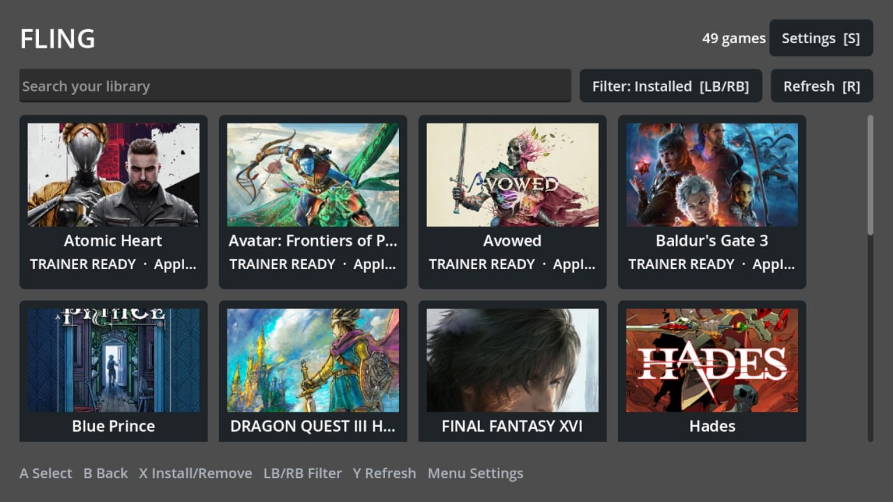

# Fling UI

Fling UI is a fullscreen, controller-first trainer manager for Steam and Proton on Linux. It pairs a Godot 4 .NET frontend with the existing `fling` Bash CLI.



*Fling’s controller-first library grid on a Bazzite handheld, showing local Steam artwork fallback and trainer states.*

The target systems are Bazzite and Steam Gaming Mode on Steam Deck, ROG Ally, Xbox Ally, and regular Linux desktops. It does not require root and installs only below the current user's home directory.

## Safety warning

**Single-player only. Never use trainers in online or multiplayer games. Online services and anti-cheat systems may ban accounts or block the game. Trainers are third-party Windows executables and may be unsafe.** Fling's SHA-256 metadata is diagnostic change tracking, not proof that a trainer is safe. Fling is not affiliated with FLiNG or Valve.

## Architecture

The boundary is deliberate:

- `bin/fling` owns Steam discovery, trainer downloads, validation, systemd integration, Proton injection, and trainer execution.
- `ui/` owns presentation, input, local artwork lookup, settings, and friendly errors. It invokes the CLI without a shell through a versioned JSON API.
- Trainers remain in `~/Trainers/<appid> - <game name>/Trainer.exe`.

The JSON API is schema version 1:

```text
fling games --json
fling installed --json
fling status --json
fling install <appid> --json
fling remove <appid> --json
fling refresh <appid> --json
```

`refresh` is intentionally local and safe: it re-reads the selected game's Steam manifest and current trainer state. It does not contact the network or modify files. JSON stdout contains JSON only; diagnostics use stderr. Exit codes are 0 success, 1 general, 2 invalid arguments, 3 missing game, 4 missing remote trainer, 5 network/download, 6 invalid file, 7 missing local trainer, 8 missing dependency, 9 unsafe path, and 10 Steam configuration.

Downloads use redirect handling, HTTP failure checks, connection and total timeouts, size validation, detected-file validation, and ZIP dependency checks. A successful install writes `trainer-metadata.json` beside `Trainer.exe`, including the source URLs, SHA-256, and UTC installation time.

## Install Fling UI + CLI

On an x86_64 Linux or Bazzite system, run:

```bash
curl -fsSL https://raw.githubusercontent.com/ajamaica/fling/main/install.sh | bash
```

The bootstrap requires Bash, `curl`, GNU `tar`, `sha256sum`, `awk`, and `mktemp`. It downloads only the release archive and `SHA256SUMS` from this repository's GitHub Releases, verifies the archive before extraction, and installs as the current user below `~/.local` and `~/.config`. It never uses `sudo`. The release includes the prebuilt Godot UI, so end users do not need Godot, .NET, or a source checkout.

By default, the command installs the latest stable GitHub release. Re-run it to update or repair the installation. To install a specific published tag, set `FLING_VERSION`:

```bash
curl -fsSL https://raw.githubusercontent.com/ajamaica/fling/main/install.sh | FLING_VERSION=v1.2.3 bash
```

After installation, reboot once or run `fling restart-steam` after closing games. The UI is available as **Fling Trainer Manager** in the desktop application menu and as `fling-ui` in a terminal.

## Runtime prerequisites

- Steam and Proton
- Bash, Python 3, curl, `file`, systemd user services and `busctl`
- `unzip` when a trainer is distributed as ZIP
- `protontricks` for existing manual trainer execution behavior

Optional `xdotool` and `xprop` improve Gaming Mode window tagging.

## Source-developer installation

The repository checkout is not needed for the one-liner. Developers working from a clone can install just the CLI and systemd integration with:

```bash
./packaging/install-cli-from-source.sh
```

Run `fling setup`, then reboot once or run `fling restart-steam` after closing games. Existing human-readable commands (`list`, `get`, `auto`, `run`, `setup`, `installed`, `watch`) remain available.

## Develop and export the UI

```bash
cd ui
dotnet build
FLING_UI_MOCK=1 godot --editor project.godot
```

Mock mode provides a functional library and operations without Steam or the CLI. Set `FLING_CLI_PATH=/path/to/bin/fling` to use a development CLI. Otherwise the app uses `~/.local/bin/fling`, with `../bin/fling` as a source-tree fallback.

In the Godot .NET editor, install matching export templates, create a **Linux/X11** preset, and export into a directory. Godot normally names the Linux executable `fling-ui.x86_64`; leave that filename unchanged. Then install the whole export directory (the executable, `.pck`, and `data_*` directory must stay together):

```bash
./packaging/install-ui.sh /path/to/linux-export-directory
```

For example, if the Godot export path is `/tmp/fling-export/fling-ui.x86_64`, install it with:

```bash
./packaging/install-ui.sh /tmp/fling-export
```

The installer needs no root access. It copies the export under `~/.local/share/fling-ui/`, creates the launcher at `~/.local/bin/fling-ui`, and writes a desktop entry at `~/.local/share/applications/fling-ui.desktop`. It is safe to rerun after exporting an update. Install the CLI too with `./packaging/install-cli-from-source.sh`; the UI uses that CLI for Steam discovery and trainer operations.

Release maintainers create the distributable from an already verified Linux Godot export. `SOURCE_DATE_EPOCH` may be set to the release timestamp; identical inputs and timestamps produce identical archives:

```bash
SOURCE_DATE_EPOCH=1700000000 ./packaging/package-release.sh /path/to/linux-export-directory dist
```

This writes `dist/fling-linux-x86_64.tar.gz` and `dist/SHA256SUMS`. Publish both files on the same GitHub release tag. The archive contains the CLI, user service, hardened UI installer, inner bundle installer, and prebuilt UI export.

On Bazzite or another Steam Gaming Mode system, test the app in Desktop Mode first by launching **Fling Trainer Manager** from the application menu (or run `~/.local/bin/fling-ui`). To add it to Gaming Mode, open Steam in Desktop Mode, choose **Games → Add a Non-Steam Game**, browse to `~/.local/bin/fling-ui`, add it, then return to Gaming Mode.

## Controller and keyboard

| Action | Controller | Keyboard |
|---|---|---|
| Select | A | Enter |
| Back | B | Escape |
| Install/remove | X | X |
| Refresh | Y | R or F5 |
| Settings | Menu | S |
| Previous/next filter | LB/RB | Q/E |

Focus is always visible. Navigation remains enabled while one global trainer modification is running, but other modification actions are disabled. Dialogs capture focus, focused cards stay scrolled into view, and returning from details restores the nearest relevant card.

## Troubleshooting

- **No games:** open Settings and check the detected Steam root. Flatpak Steam is supported. Custom library paths, including paths with spaces, are read from `libraryfolders.vdf`.
- **CLI not found:** install the CLI or set `FLING_CLI_PATH` for development.
- **Trainer not found:** FLiNG may not publish one for that title. This maps to exit code 4.
- **ZIP dependency error:** install `unzip` and retry.
- **Environment inactive:** close games, then use Settings to restart Steam, or reboot.
- **Details needed:** logs are at Godot's `user://logs/fling-ui.log` and rotate at roughly 512 KiB. Environment secrets and raw command output are not logged.
- **Trainer cannot attach:** confirm the watcher and Steam environment are active, and remember trainers support Proton games, not native Linux executables.

## Test

The CLI suite is self-contained and never downloads or executes a real trainer:

```bash
tests/run.sh
bash -n bin/fling install.sh uninstall.sh tests/run.sh packaging/*.sh
dotnet run --project ui/tests/FlingUi.Tests.csproj
dotnet build ui/FlingUi.sln
dotnet format ui/FlingUi.csproj --verify-no-changes --no-restore
```

CI additionally runs ShellCheck and Godot project sanity checks.

## Uninstall

```bash
./packaging/uninstall-ui.sh  # preserves ~/Trainers
./uninstall.sh               # removes CLI/integration, preserves trainers
./uninstall.sh --purge       # also removes ~/Trainers
```

## License

MIT, see [LICENSE](LICENSE).
