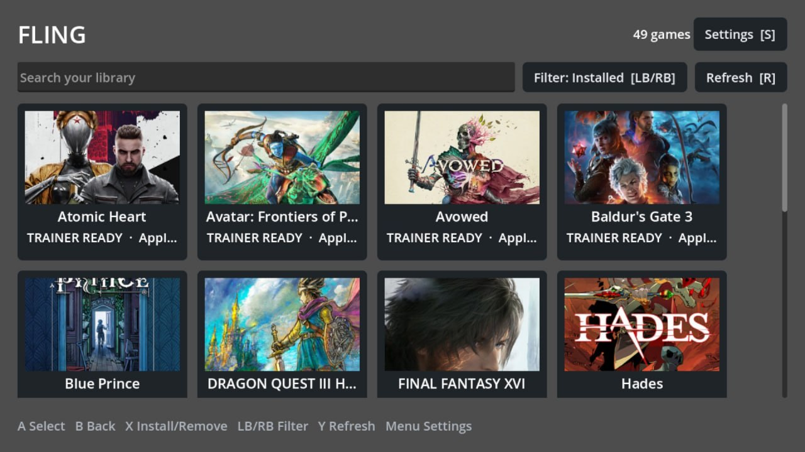

# Fling UI

Fling UI is a fullscreen, controller-first trainer manager for Steam and Proton on Linux. It pairs a Godot 4 .NET frontend with the existing `fling` Bash CLI.



*Fling’s controller-first library grid on a Bazzite handheld, showing local Steam artwork fallback and trainer states.*

The target systems are Bazzite and Steam Gaming Mode on Steam Deck, ROG Ally, Xbox Ally, and regular Linux desktops. It does not require root and installs only below the current user's home directory.

## Safety warning

**Single-player only. Never use trainers in online or multiplayer games. Online services and anti-cheat systems may ban accounts or block the game. Trainers are third-party Windows executables and may be unsafe.** Fling's SHA-256 metadata is diagnostic change tracking, not proof that a trainer is safe. Fling is not affiliated with FLiNG or Valve.

## Architecture

The boundary is deliberate:

- `src/` contains the Rust CLI: Steam discovery, trainer downloads, validation, systemd integration, Proton injection, and trainer execution. `bin/fling` is only its stable launcher.
- `ui/` owns presentation, input, local artwork lookup, settings, and friendly errors. It invokes the CLI without a shell through a versioned JSON API.
- Trainers remain in `~/Trainers/<appid> - <game name>/Trainer.exe`.

The JSON API is schema version 1:

```text
fling games --json
fling installed --json
fling status --json
fling install <appid> --json
fling remove <appid> --json
fling refresh <appid> --json
fling use <appid> fling|wemod|both --json
fling wemod install <appid> --json
fling wemod dotnet <appid> [--check] --json
```

`refresh` is intentionally local and safe: it re-reads the selected game's Steam manifest and current trainer state. It does not contact the network or modify files. JSON stdout contains JSON only; diagnostics use stderr. Exit codes are 0 success, 1 general, 2 invalid arguments, 3 missing game, 4 missing remote trainer, 5 network/download, 6 invalid file, 7 missing local trainer, 8 missing dependency, 9 unsafe path, 10 Steam configuration, 11 game-specific runtime installation failure, and 12 managed runtime removal conflict.

Downloads use redirect handling, HTTP failure checks, connection and total timeouts, size validation, detected-file validation, and ZIP dependency checks. A successful install writes `trainer-metadata.json` beside `Trainer.exe`, including the source URLs, SHA-256, and UTC installation time.

PRAGMATA (Steam app 3357650) requires REFramework for the FLiNG trainer's anti-cheat bypass. Fling installs only `dinput8.dll` from a pinned official nightly release into the verified game root, verifies the release asset's published SHA-256, and records `.fling-reframework.json` there. It will not overwrite an unmanaged or externally changed `dinput8.dll`; resolve that mod-loader conflict manually and retry. Removing the trainer also removes these runtime files only when their metadata and checksum still prove that Fling manages them.

## WeMod (optional)

WeMod is another trainer option next to FLiNG, and neither takes priority. For each game you choose what starts at boot: **FLiNG**, **[WeMod](https://www.wemod.com/)**, or **both**. Games you never set keep using FLiNG, as before.

```bash
fling use <game>              # show the game's current choice
fling use <game> fling        # FLiNG trainer
fling use <game> wemod        # WeMod
fling use <game> both         # FLiNG trainer and WeMod together
```

In the UI, open a game and use the **Start with game: FLiNG / WeMod / Both** buttons, or **Install WeMod** (**Update WeMod** once installed). Choosing WeMod or Both before WeMod is installed installs it first. **Check .NET for WeMod** checks the game's prefix for .NET Framework 4.8 and installs it only if it is missing.

WeMod is a Windows app with its own account. Fling installs it for you, **once**, and every game shares that install and your sign-in:

```bash
# Launch any game once so its Proton prefix exists, then close it.
fling use <game> wemod           # installs WeMod automatically the first time, then selects it
# Sign in when WeMod opens, then close it. That's the only sign-in you need.
fling use <other-game> wemod     # reuses the same install and sign-in, no download

fling wemod install <appid>      # (re)install or update WeMod on demand; add --dotnet for .NET 4.8
fling wemod dotnet <appid>       # check .NET 4.8 for that game and install it only if missing
fling wemod setup <appid> ~/Downloads/WeMod-Setup.exe   # use an installer you downloaded yourself
fling wemod status               # shared install and sign-in paths, and games using WeMod
```

The automatic install downloads WeMod's official installer from `https://api.wemod.com/client/download` (set `FLING_WEMOD_URL` to override it). It checks that the download is a Windows executable and runs it in that game's prefix. The SHA-256 and time are recorded in `~/.local/share/fling/wemod/fling-install.json` for change tracking. WeMod publishes no checksum, so, as with trainers, this is not proof the file is safe. If WeMod is already installed in any game's prefix, Fling shares that install instead of downloading again.

How the sharing works:

- **Install:** `install`/`setup` run the installer in that game's prefix with `protontricks-launch`, then copy the install to `~/.local/share/fling/wemod/`. Every game runs WeMod from there, so WeMod also updates once for all games.
- **Sign-in:** each game's `%APPDATA%\WeMod` (`drive_c/users/steamuser/AppData/Roaming/WeMod` in its prefix) becomes a link to `~/.local/share/fling/wemod-profile/`, where the session lives. The first game's existing WeMod profile is adopted as the shared one. A profile that another game already had is kept next to the link as `WeMod.fling-backup-<time>` and never deleted.
- Fling does this automatically before each WeMod launch. A WeMod already installed in a game's prefix is picked up and shared the first time that game starts WeMod.

`setup` does not change the game's choice; pick it with `fling use`. At boot, the watcher starts whatever the game is set to inside its container as soon as the game process is ready. Game profiles such as Elden Ring's delay still apply. With `both`, a crashed trainer is retried without starting a second WeMod, and a missing FLiNG trainer or WeMod only produces a warning while the other still starts. Two trainers writing the same values can fight each other, so avoid turning on the same cheat in both. Because the sign-in is one shared profile, run WeMod for one game at a time.

`fling games --json` reports `trainer_choice` (`"fling"`, `"wemod"` or `"both"`) and `wemod_enabled`; choices are stored in `~/.config/fling/wemod-appids`. WeMod needs .NET Framework 4.8, which is per game prefix (unlike WeMod itself). `fling wemod dotnet <appid>` checks the prefix (winetricks log or the `NDP\v4\Full` registry `Release`) and runs `protontricks <appid> -q dotnet48` only when it is missing; add `--check` to only check. The single-player-only warning above applies to WeMod too.

## Install Fling UI + CLI

On an x86_64 Linux or Bazzite system, run:

```bash
curl -fsSL https://raw.githubusercontent.com/ajamaica/fling/main/install.sh | bash
```

The bootstrap requires Bash, `curl`, GNU `tar`, `sha256sum`, `awk`, and `mktemp`. It downloads only the release archive and `SHA256SUMS` from this repository's GitHub Releases, verifies the archive before extraction, and installs as the current user below `~/.local` and `~/.config`. It never uses `sudo`. The release includes the prebuilt Godot UI, so end users do not need Godot, .NET, or a source checkout.

By default, the command installs the latest stable GitHub release. Re-run it to update or repair the installation. To install a specific published tag, set `FLING_VERSION`:

```bash
curl -fsSL https://raw.githubusercontent.com/ajamaica/fling/main/install.sh | FLING_VERSION=v1.2.3 bash
```

After installation, reboot once or run `fling restart-steam` after closing games. The UI is available as **Fling Trainer Manager** in the desktop application menu and as `fling-ui` in a terminal.

## Runtime prerequisites

- Steam and Proton
- Bash, Python 3, curl, `file`, systemd user services and `busctl`
- `unzip` when a trainer is distributed as ZIP
- `protontricks` for existing manual trainer execution behavior

Optional `xdotool` and `xprop` improve Gaming Mode window tagging.

## Source-developer installation

The repository checkout is not needed for the one-liner. Developers working from a clone can install just the CLI and systemd integration with:

```bash
./packaging/install-cli-from-source.sh
```

Run `fling setup`, then reboot once or run `fling restart-steam` after closing games. Existing human-readable commands (`list`, `get`, `auto`, `run`, `setup`, `installed`, `watch`) remain available, plus `use` and `wemod` for choosing WeMod per game.

## Develop and export the UI

```bash
cd ui
dotnet build
FLING_UI_MOCK=1 godot --editor project.godot
```

Mock mode provides a functional library and operations without Steam or the CLI. Set `FLING_CLI_PATH=/path/to/bin/fling` to use a development CLI. Otherwise the app uses `~/.local/bin/fling`, with `../bin/fling` as a source-tree fallback.

In the Godot .NET editor, install matching export templates, create a **Linux/X11** preset, and export into a directory. Godot normally names the Linux executable `fling-ui.x86_64`; leave that filename unchanged. Then install the whole export directory (the executable, `.pck`, and `data_*` directory must stay together):

```bash
./packaging/install-ui.sh /path/to/linux-export-directory
```

For example, if the Godot export path is `/tmp/fling-export/fling-ui.x86_64`, install it with:

```bash
./packaging/install-ui.sh /tmp/fling-export
```

The installer needs no root access. It copies the export under `~/.local/share/fling-ui/`, creates the launcher at `~/.local/bin/fling-ui`, and writes a desktop entry at `~/.local/share/applications/fling-ui.desktop`. It is safe to rerun after exporting an update. Install the CLI too with `./packaging/install-cli-from-source.sh`; the UI uses that CLI for Steam discovery and trainer operations.

Release maintainers create the distributable from an already verified Linux Godot export. `SOURCE_DATE_EPOCH` may be set to the release timestamp; identical inputs and timestamps produce identical archives:

```bash
SOURCE_DATE_EPOCH=1700000000 ./packaging/package-release.sh /path/to/linux-export-directory dist
```

This writes `dist/fling-linux-x86_64.tar.gz` and `dist/SHA256SUMS`. Publish both files on the same GitHub release tag. The archive contains the CLI, user service, hardened UI installer, inner bundle installer, and prebuilt UI export.

On Bazzite or another Steam Gaming Mode system, test the app in Desktop Mode first by launching **Fling Trainer Manager** from the application menu (or run `~/.local/bin/fling-ui`). To add it to Gaming Mode, open Steam in Desktop Mode, choose **Games → Add a Non-Steam Game**, browse to `~/.local/bin/fling-ui`, add it, then return to Gaming Mode.

## Controller and keyboard

| Action | Controller | Keyboard |
|---|---|---|
| Select | A | Enter |
| Back | B | Escape |
| Install/remove | X | X |
| Refresh | Y | R or F5 |
| Settings | Menu | S |
| Previous/next filter | LB/RB | Q/E |

Focus is always visible. Navigation remains enabled while one global trainer modification is running, but other modification actions are disabled. Dialogs capture focus, focused cards stay scrolled into view, and returning from details restores the nearest relevant card.

## Troubleshooting

- **No games:** open Settings and check the detected Steam root. Flatpak Steam is supported. Custom library paths, including paths with spaces, are read from `libraryfolders.vdf`.
- **CLI not found:** install the CLI or set `FLING_CLI_PATH` for development.
- **Trainer not found:** FLiNG may not publish one for that title. This maps to exit code 4.
- **ZIP dependency error:** install `unzip` and retry.
- **Environment inactive:** close games, then use Settings to restart Steam, or reboot.
- **Details needed:** logs are at Godot's `user://logs/fling-ui.log` and rotate at roughly 512 KiB. Environment secrets and raw command output are not logged.
- **Trainer cannot attach:** confirm the watcher and Steam environment are active, and remember trainers support Proton games, not native Linux executables.
- **PRAGMATA runtime-support error:** Fling could not safely install REFramework. Check network access and the game directory. If `dinput8.dll` already belongs to another mod setup, Fling deliberately leaves it untouched.

## Test

Developers need a current stable Rust toolchain. Build with `cargo build`; the
source-tree `bin/fling` launcher then uses `target/debug/fling-rs`. Release
bundles put a prebuilt x86_64 Linux binary beside the launcher, so end-user
systems do not need Cargo or Rust.

The CLI suite is self-contained and never downloads or executes a real trainer:

```bash
tests/run.sh
bash -n bin/fling install.sh uninstall.sh tests/run.sh packaging/*.sh
cargo fmt --check
cargo test --all-targets
cargo clippy --all-targets -- -D warnings
dotnet run --project ui/tests/FlingUi.Tests.csproj
dotnet build ui/FlingUi.sln
dotnet format ui/FlingUi.csproj --verify-no-changes --no-restore
```

CI additionally runs ShellCheck and Godot project sanity checks.

## Uninstall

```bash
./packaging/uninstall-ui.sh  # preserves ~/Trainers
./uninstall.sh               # removes CLI/integration, preserves trainers
./uninstall.sh --purge       # also removes ~/Trainers
```

## License

MIT, see [LICENSE](LICENSE).
